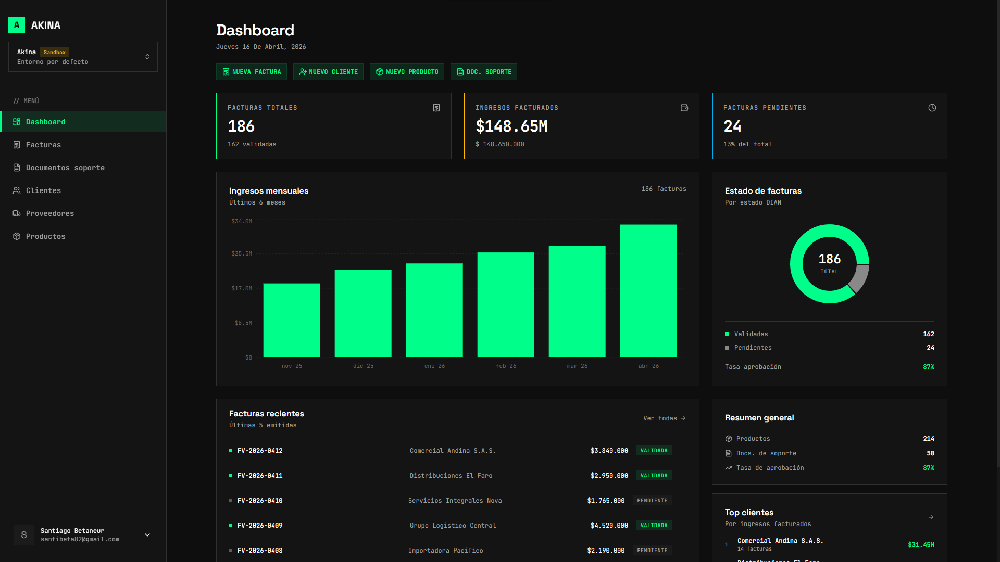

# Akina

Modern electronic invoicing platform for Colombia, built with Next.js, Elysia, Better Auth, and Drizzle ORM.



## Overview

Akina is a full-stack invoicing application focused on the Colombian market. It streamlines the creation and management of invoices, support documents, customers, providers, and products while integrating with Factus for electronic document workflows and DIAN-facing validation flows.

The project combines:

- a polished Next.js App Router frontend,
- a typed API layer powered by Elysia,
- a PostgreSQL data layer with Drizzle ORM,
- secure auth/session flows with Better Auth,
- transactional email delivery through Resend.

## Core Features

- Invoice lifecycle management with creation, listing, details, and PDF download.
- Support documents flow for purchases to non-obligated invoice issuers.
- Credit notes and adjustment notes with dedicated forms and export flows.
- Customer, provider, and product master data management.
- Dashboard analytics (monthly revenue, invoice status, KPI summary, top customers).
- Factus credential management per user plus shared sandbox fallback.
- Authentication flows: register, login, email verification, password reset, and 2FA plugin support.
- Server-side environment validation and encryption key handling for sensitive fields.

## Tech Stack

### Frontend

- [Next.js 16](https://nextjs.org/) (App Router)
- [React 19](https://react.dev/)
- [Tailwind CSS v4](https://tailwindcss.com/)
- [Motion](https://motion.dev/) for UI animation
- [TanStack Query](https://tanstack.com/query/latest) for server-state management
- [TanStack Table](https://tanstack.com/table/latest) for advanced data tables
- [Recharts](https://recharts.org/) for dashboard charting
- [shadcn/ui](https://ui.shadcn.com/) component patterns

### Backend and Data

- [Elysia](https://elysiajs.com/) for typed API modules
- [Better Auth](https://www.better-auth.com/) for authentication and session management
- [Drizzle ORM](https://orm.drizzle.team/) + [drizzle-kit](https://orm.drizzle.team/docs/kit-overview)
- [Neon Serverless Postgres](https://neon.tech/) compatible PostgreSQL driver
- [Zod](https://zod.dev/) and [@t3-oss/env-nextjs](https://env.t3.gg/docs/nextjs) for runtime env validation
- [Resend](https://resend.com/) + [React Email](https://react.email/) for transactional email
- [Factus JS](https://www.npmjs.com/package/factus-js) for Factus API integration

### Tooling

- [Biome](https://biomejs.dev/) for linting/checking
- [Prettier](https://prettier.io/) for formatting
- [TypeScript](https://www.typescriptlang.org/)
- [Bun](https://bun.sh/) compatible scripts (non-Windows flow)

## Project Structure

```text
app/                 Next.js App Router pages and layouts
components/          Reusable UI + domain components
elysia/              API modules, services, and typed route layer
db/                  Drizzle schema and migrations
lib/                 Shared utilities (auth, env, crypto, Factus client)
hooks/               React Query hooks for API interaction
emails/              Transactional email templates (React Email)
public/              Static assets (including dashboard preview)
```

## Environment Variables

Copy `.env.example` to `.env.local` and fill in your values.

```bash
cp .env.example .env.local
```

The required variables are documented in `.env.example`:

- `NEXT_PUBLIC_BASE_URL`
- `DATABASE_URL`
- `BETTER_AUTH_SECRET`
- `RESEND_API_KEY`
- `RESEND_FROM`
- `FACTUS_USERNAME`
- `FACTUS_PASSWORD`
- `FACTUS_CLIENT_ID`
- `FACTUS_CLIENT_SECRET`
- `ENCRYPTION_KEY` (64-char hex string / 32 bytes)

## Getting Started

### 1) Install dependencies

```bash
npm install
```

### 2) Configure environment

```bash
cp .env.example .env.local
```

### 3) Run the development server

```bash
npm run dev
```

Open [http://localhost:3000](http://localhost:3000).

## Available Scripts

- `npm run dev` - starts the development server.
- `npm run build` - builds the production app.
- `npm run start` - serves the production build.
- `npm run lint` - runs Biome checks.
- `npm run lint:fix` - runs Biome with auto-fix.
- `npm run format` - formats code with Prettier.
- `npm run email` - runs React Email preview server on port 3001.

## API and Architecture Notes

- Elysia app is mounted under `/api` and exposed through `app/api/[[...slugs]]/route.ts`.
- Better Auth is configured server-side and integrated with Drizzle-backed persistence.
- Factus has a shared sandbox fallback client when users do not have active credentials.
- Sensitive provider/client credentials are encrypted before persistence and decrypted only for runtime use.

## Build for Production

```bash
npm run build
npm run start
```

## Contributing

If you want to contribute, please open an issue first to discuss major changes and implementation approach.
